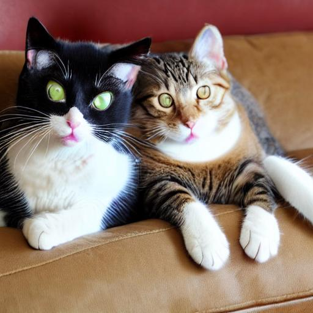

# my_dediffusion

This is the my unofficial implementaion of the model from paper "De-Diffusion Makes Text a Strong Cross-Modal Interface" by Chen Wei, Chenxi Liu, Siyuan Qiao, Zhishuai Zhang, Alan Yuille and Jiahui Yu. Hope this repo can give a easy to use code framework for anyone like me wishes to reproduce the paper.

## Project structure

The directory structure of the project looks like this:

```txt
├── README.md            <- The top-level README for developers using this project.
├── datasets
│   ├──dataloader.py         <- load the datasets and preprocessing.
│
│
├── requirements.txt     <- The requirements file for reproducing the analysis environment
│
├── models  <- Source code for use in this project.
│   ├── __init__.py
│   ├── decoder.py
│   ├── encoder.py
│   │
│── train_model.py   <- script for training the model
│── predict_model.py <- script for predicting from a model
│
├── utils   <- helper files for genric project.
│   ├── __init__.py
│   ├── ckpt.py
│   ├── config.py
│   ├── distributed.py
│   ├── logging.py
│   ├── utils.py
├── assets               <- for github repo 
└── LICENSE              <- Open-source license if one is chosen
```
## Installation 
Instructions on how to clone and set up your repository:

### Clone this repo :

Clone the repository and navigate to the project directory:

```bash
git clone https://github.com/Yaxin9Luo/my_dediffusion.git
cd my_dediffusion
```

### Create a conda virtual environment and activate it:
```bash
conda create -n dediffusion python=3.11 -y
conda activate dediffusion
```
### Install the required dependencies:
```bash
pip install -r requirements.txt
```
## Training 
If you wish to train the Attention Pooler inside the image to text encoder block which is mentioned in the paper, you can use the following instruction and modify the config file for your own need. (note: I trained 100 images on a A100 for around 2 hours)
```bash
python train.py --config ./configs/main.yaml
```
## Inference with pretrained models
Here I used pretrained BLip and Stable diffusion, you can change to whatever you like, for example, in the offcial paper, the authors mentioned that they use VIT-L and Imagen. 

```bash 
python inference.py --config ./configs/main.yaml
```
### One Example
I have not yet finetune the model with a lot of data, so the result is not that astonishing. 

Original Image : 

 

Inference Image:



## Citation
```bash 
@article{wei2023dediffusion,
  title={De-Diffusion Makes Text a Strong Cross-Modal Interface},
  author={Wei, Chen and Liu, Chenxi and Qiao, Siyuan and Zhang, Zhishuai and Yuille, Alan and Yu, Jiahui},
  journal={arXiv preprint arXiv:2311.00618},
  year={2023},
  url={https://arxiv.org/abs/2311.00618}
}

